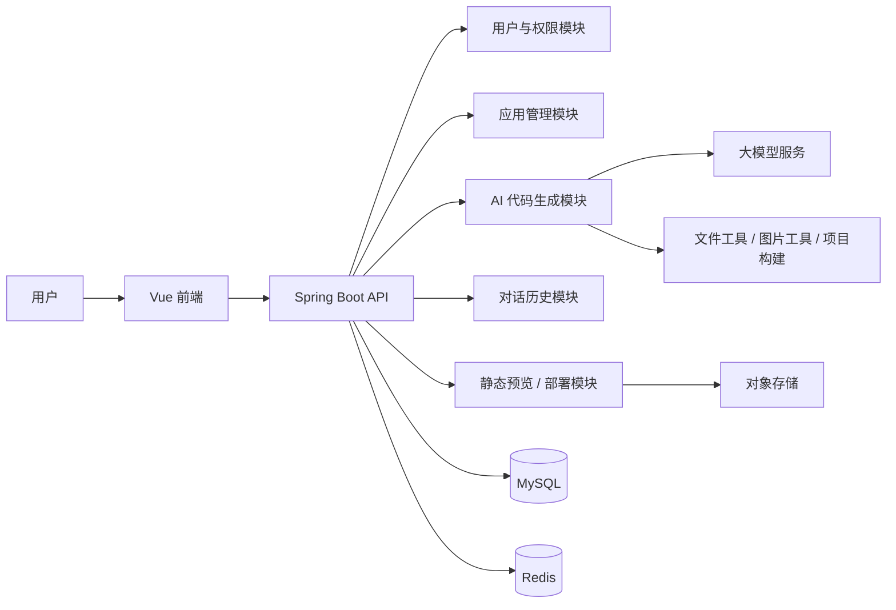
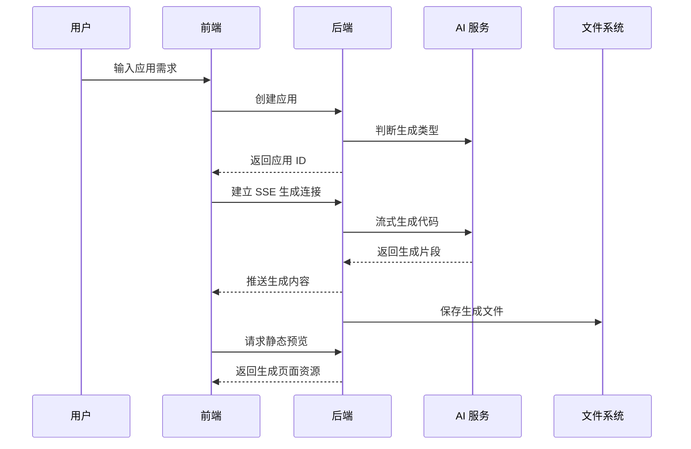

# yu-ai-code-mother

`yu-ai-code-mother` 是一个 AI 代码生成与应用发布平台。用户输入自然语言需求后，系统会自动选择合适的代码生成模式，流式生成网页或 Vue 项目代码，并支持在线预览、二次对话修改、代码下载、应用部署、封面截图和后台管理。

## 项目演示

> 以下位置预留给项目演示图片，可按需手动插入截图或 GIF。

### 首页与应用广场


### AI 对话生成页面


### 应用部署效果


### 后台管理


## 核心功能

- 自然语言创建应用：输入需求描述后创建应用，并进入 AI 对话生成流程。
- 智能生成类型路由：根据用户需求自动选择 `html`、`multi_file` 或 `vue_project` 生成模式。
- 流式代码生成：基于 SSE 实时返回 AI 生成内容，前端同步展示对话过程。
- 实时预览：生成完成后通过静态资源接口预览网页效果。
- 多轮对话迭代：保留应用级对话历史，支持继续描述修改需求。
- 可视化编辑辅助：在预览区选择页面元素后，可把元素信息带入下一轮修改提示。
- 应用部署：将生成结果部署到本地发布目录，并返回可访问链接。
- 代码下载：应用创建者可下载生成代码压缩包。
- 自动封面截图：部署后可通过 Selenium 截图，并上传到对象存储作为应用封面。
- 用户体系：支持注册、登录、退出、当前登录用户获取。
- 后台管理：管理员可管理用户、应用、精选应用和对话记录。
- 限流与缓存：AI 对话接口支持基于 Redis/Redisson 的限流，精选应用列表支持缓存。

## 技术栈

### 后端

- Java 21
- Spring Boot 3.5.10
- Spring Web / AOP / Session
- MyBatis-Flex
- MySQL
- Redis / Redisson / Spring Session Data Redis
- LangChain4j
- LangGraph4j
- Reactor Flux + Server-Sent Events
- Knife4j / OpenAPI 3
- Selenium / WebDriverManager
- 腾讯云 COS
- DashScope / OpenAI Compatible API
- Hutool

### 前端

- Vue 3
- TypeScript
- Vite
- Vue Router
- Pinia
- Ant Design Vue
- Axios
- Markdown-it
- Highlight.js

## 系统架构



## 生成流程



## 项目结构

```text
.
├── sql/                              # 数据库初始化脚本
│   └── create_sql.sql
├── src/
│   ├── main/
│   │   ├── java/com/resky/yuaicodemother/
│   │   │   ├── ai/                  # LangChain4j AI 服务、模型与工具调用
│   │   │   ├── annotation/          # 权限注解
│   │   │   ├── aop/                 # 权限拦截
│   │   │   ├── common/              # 通用响应、分页、删除请求
│   │   │   ├── config/              # CORS、Redis、AI 模型、COS 等配置
│   │   │   ├── constant/            # 常量
│   │   │   ├── controller/          # REST API 控制器
│   │   │   ├── core/                # 代码解析、保存、构建、流处理
│   │   │   ├── exception/           # 全局异常处理
│   │   │   ├── langgraph4j/         # 工作流、节点、图片资源收集工具
│   │   │   ├── manager/             # COS 管理
│   │   │   ├── mapper/              # MyBatis-Flex Mapper
│   │   │   ├── model/               # DTO、Entity、Enum、VO
│   │   │   ├── ratelimiter/         # 接口限流
│   │   │   ├── service/             # 业务服务
│   │   │   └── utils/               # 工具类
│   │   └── resources/
│   │       ├── mapper/              # XML Mapper
│   │       ├── prompt/              # AI 系统提示词
│   │       ├── application.yml
│   │       └── application-local.yml
│   └── test/                        # 后端测试
├── tmp/                             # 生成代码与部署产物目录
├── yu-ai-code-mother-frontend/       # Vue 前端项目
│   ├── src/
│   │   ├── api/                     # OpenAPI 生成的接口请求
│   │   ├── components/              # 公共组件
│   │   ├── config/                  # 前端环境配置
│   │   ├── layouts/                 # 页面布局
│   │   ├── pages/                   # 页面
│   │   ├── router/                  # 路由
│   │   ├── stores/                  # Pinia 状态
│   │   └── utils/                   # 工具函数
│   ├── package.json
│   └── vite.config.ts
├── pom.xml
└── README.md
```

## 环境要求

- JDK 21+
- Maven 3.9+
- Node.js 22+，建议与前端依赖版本保持一致
- MySQL 8+
- Redis 6+
- 可访问的大模型 API Key
- 如需封面截图与对象存储上传，需要配置 Selenium 运行环境和腾讯云 COS

## 快速开始

### 1. 克隆项目

```bash
git clone <your-repository-url>
cd yu-ai-code-mother
```

### 2. 初始化数据库

执行数据库脚本：

```bash
mysql -u root -p < sql/create_sql.sql
```

脚本会创建 `yu_ai_code_mother` 数据库，并初始化以下表：

- `user`：用户表
- `app`：应用表
- `chat_history`：对话历史表

### 3. 配置后端

后端默认读取 `src/main/resources/application.yml`，并启用 `local` profile。请根据本地环境配置数据库、Redis、AI 模型和对象存储。

建议将敏感信息放在本地配置或环境变量中，不要提交真实密钥。

```yaml
spring:
  datasource:
    url: jdbc:mysql://localhost:3306/yu_ai_code_mother
    username: root
    password: your-password
  data:
    redis:
      host: localhost
      port: 6379
      database: 1

server:
  port: 8123
  servlet:
    context-path: /api

langchain4j:
  open-ai:
    chat-model:
      base-url: https://your-model-compatible-endpoint
      api-key: your-api-key
      model-name: your-model-name
    streaming-chat-model:
      base-url: https://your-model-compatible-endpoint
      api-key: your-api-key
      model-name: your-streaming-model-name

cos:
  client:
    host: your-cos-domain
    secretId: your-secret-id
    secretKey: your-secret-key
    region: ap-shanghai
    bucket: your-bucket-name

pexels:
  api-key: your-pexels-api-key

dashscope:
  api-key: your-dashscope-api-key
  image-model: your-image-model-name
```

### 4. 启动后端

```bash
./mvnw spring-boot:run
```

Windows 环境可使用：

```bash
mvnw.cmd spring-boot:run
```

后端默认地址：

```text
http://localhost:8123/api
```

接口文档默认地址：

```text
http://localhost:8123/api/doc.html
```

健康检查：

```text
GET http://localhost:8123/api/health/
```

### 5. 配置前端

进入前端目录：

```bash
cd yu-ai-code-mother-frontend
npm install
```

本地开发环境变量位于 `.env.development`：

```env
VITE_DEPLOY_DOMAIN=http://localhost
VITE_API_BASE_URL=/api
```

Vite 已配置 `/api` 代理到后端：

```text
http://localhost:8123
```

### 6. 启动前端

```bash
npm run dev
```

前端启动后访问终端输出的本地地址，通常为：

```text
http://localhost:5173
```

## 常用命令

### 后端

```bash
# 启动
./mvnw spring-boot:run

# 测试
./mvnw test

# 打包
./mvnw clean package
```

### 前端

```bash
# 安装依赖
npm install

# 开发环境
npm run dev

# 类型检查 + 构建
npm run build

# 预览构建产物
npm run preview

# 代码检查
npm run lint

# 格式化
npm run format

# 根据后端 OpenAPI 重新生成接口
npm run openapi2ts
```

## 主要页面

- `/`：首页，创建应用、查看我的应用、查看精选应用。
- `/user/login`：用户登录。
- `/user/register`：用户注册。
- `/app/chat/:id`：应用对话生成页，包含 AI 对话、实时预览、部署、下载和可视化编辑辅助。
- `/app/edit/:id`：应用编辑页。
- `/admin/userManage`：用户管理。
- `/admin/appManage`：应用管理。
- `/admin/chatManage`：对话记录管理。

## 主要接口

后端统一前缀为 `/api`。

### 用户接口

- `POST /user/register`：用户注册
- `POST /user/login`：用户登录
- `GET /user/get/login`：获取当前登录用户
- `POST /user/logout`：退出登录
- `POST /user/list/page/vo`：管理员分页查询用户

### 应用接口

- `POST /app/add`：创建应用
- `GET /app/chat/gen/code`：流式生成代码，返回 `text/event-stream`
- `POST /app/deploy`：部署应用
- `GET /app/download/{appId}`：下载应用代码
- `POST /app/delete`：删除应用
- `POST /app/update`：更新应用
- `GET /app/get/vo`：获取应用详情
- `POST /app/my/list/page/vo`：分页查询我的应用
- `POST /app/good/list/page/vo`：分页查询精选应用
- `POST /app/admin/list/page/vo`：管理员分页查询应用
- `POST /app/admin/update`：管理员更新应用
- `POST /app/admin/delete`：管理员删除应用

### 对话历史接口

- `GET /chatHistory/app/{appId}`：游标分页查询应用对话历史
- `POST /chatHistory/admin/list/page/vo`：管理员分页查询全部对话历史

### 静态资源与健康检查

- `GET /static/{dir}/**`：访问生成后的静态资源
- `GET /health/`：健康检查

## 代码生成类型

| 类型 | 值 | 说明 |
| --- | --- | --- |
| 原生 HTML | `html` | 生成单文件 HTML 应用 |
| 原生多文件 | `multi_file` | 生成 HTML、CSS、JS 等多文件结构 |
| Vue 工程 | `vue_project` | 生成 Vue 项目，部署前会执行项目构建 |

生成代码默认保存到：

```text
tmp/code_output
```

部署产物默认保存到：

```text
tmp/code_deploy
```

## 权限说明

- 普通用户可创建、编辑、删除、部署、下载自己的应用。
- 普通用户可查看精选应用和应用详情。
- 管理员可管理用户、应用和对话历史。
- 管理员可设置应用优先级，优先级为 `99` 的应用会进入精选列表。

## 注意事项

- 项目依赖 MySQL 和 Redis，启动后端前请确保服务可用。
- AI 生成、图片检索、图片生成、封面截图和对象存储上传都需要对应外部服务配置。
- 代码生成接口存在限流策略，默认按用户维度限制 AI 对话频率。
- Vue 工程部署前会执行构建，请确保生成项目依赖可正常安装和构建。
- 本地部署访问域名默认是 `http://localhost`，生产环境请根据实际域名和静态资源服务调整。
- 仓库中如存在本地密钥配置，建议迁移到本机私有配置或环境变量，避免泄露。

## License

当前仓库未声明明确许可证。如需开源发布，建议补充 `LICENSE` 文件。
